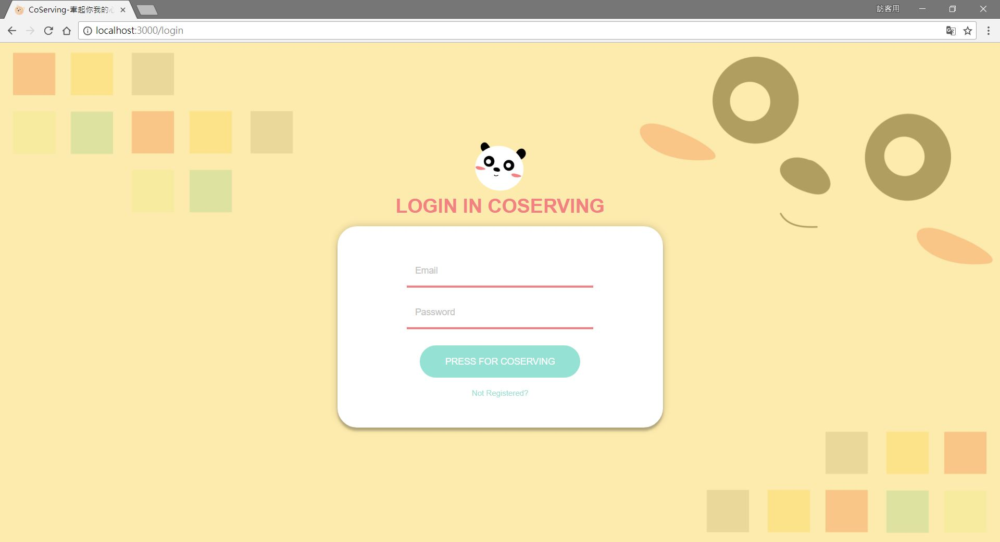
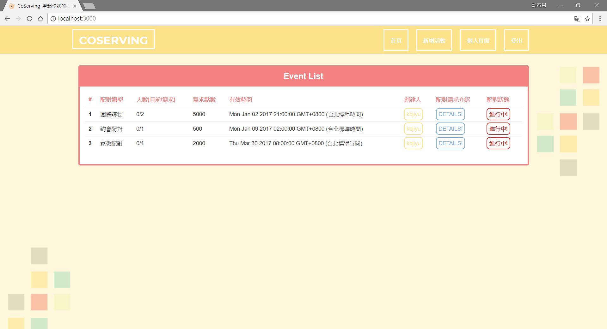

# 2017 CS+X Class Project

 

## About this github project
* Hi, this class project was built in 2017, NTU-CSX Nodejs & MongoDB course.
* Thanks to f5130052 and hannahchiu, for our group idea discussion!

 </a>
</a>

 

## Project Background
* This project is called **CoServing**, a platform for people sharing ideas. 
* Have you ever been in a situation that you can't find suitable people....not finished.

## Project Details 

* Built with **Nodejs**, **MongoDB**, **web3js**(Ethereum blockChain).
* Have to install **mongoDB**, **npm** first.

MongoDB Service
* Create a folder in desktop named *dbdata* as database directory.
* Type in **cmd** with `cd dbdata` to enter the database folder.
* Type in **cmd** with `mongod --dbpath ./data` to open a mongoDB service(will run throughd default port 27017.

Nodejs Service
* Type in **cmd** with `cd CSX_Project_Coserving_2017` to enter this project folder.
* Type in **cmd** with `npm install` to install necessary packages.
* Type in **cmd** with `npm start` to start the project.
